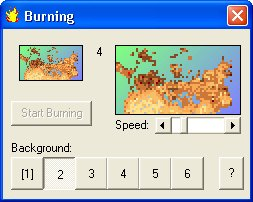



## Animated Picture

### Description

Small and well documented program to show how to bring up a sprite over a background picture. It's also animated like a gif file. No problem to change background or sprites 'source picture'...

Have fun
 
### More Info
 

             |
---                |---
**Submitted On**   |2004-06-03 14:48:02
**By**             |[Stefan Ebert](https://github.com/Planet-Source-Code/PSCIndex/blob/master/ByAuthor/stefan-ebert.md)
**Level**          |Beginner
**User Rating**    |4.5 (18 globes from 4 users)
**Compatibility**  |VB 6\.0
**Category**       |[Graphics](https://github.com/Planet-Source-Code/PSCIndex/blob/master/ByCategory/graphics__1-46.md)
**World**          |[Visual Basic](https://github.com/Planet-Source-Code/PSCIndex/blob/master/ByWorld/visual-basic.md)
**Archive File**   |[Animated\_P175334632004\.zip](https://github.com/Planet-Source-Code/stefan-ebert-animated-picture__1-54161/archive/master.zip)

